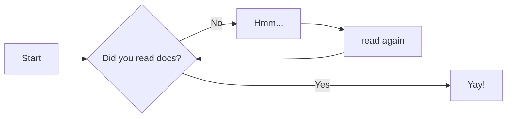

# Contributing To The Wiki

The underlying Github repo can be [located here](https://github.com/Flipper-Community/flipper-community-wiki). 

## Contributer Guidelines
The following guidelines should be kept in mind when submitting changes:

- This wiki may grow to support other Flipper items beyond just the Flipper zero, so be precise about which device you reference. 
- Our audience is international based, so use clear and precise language, avoiding slang or acronyms without explanation.
- Do not provide guides to facilitate illegal activity.
    - This includes but is not restricted to: jamming, illegal radio transmitting, defeating regional frequency locks, and fraud
- Do not provide direct links to firmwares that allow the enablement of illegal activity or defeating radio transmission region locks
- Keep your writing tone non-biased and professional.
- if you upload any images, please try to keep them below 2 Megabytes in size. 

## Wiki Structure
The General structure of this wiki is detailed below:

- **Getting Started:** contains basic info for using the device as well as commonly asked questions. 
- **Subsystems:** contains general and technical information of the different device subsystems not related to any one specific project. Guides/Tutorials should NOT go here. 
- **Development:** contains general and technical development information not related to any one specific project. Guides/Tutorials should NOT go here. 
- **Guides & Tutorials:** Contains guides, tutorials, walkthroughs for any item related to the Flipper Zero. 
    - If you are making a guide or tutorial for a category, you will want to include it here. 


## Text Formatting Examples
### Markdown

[link to another wiki page](about.md)

[link to another page and section](about.md#about-this-site)

*Italic*

**Bold**

***Bold Italic***

^^Underlined^^

> Quote Indent

Tables:

| First Header | Second Header | Third Header |
| ------------ | ------------- | ------------ |
| Content Cell | Content Cell  | Content Cell |
| Content Cell | Content Cell  | Content Cell |


`single code line`


```
multi line
codeblock
```


```python
print("Multi line codeblock")
print("with lang specific syntax highlighting")
```
Local Image Embed


Remote Image Embed with scaling

{ width="200" }

[comment]: <> (This is a hidden markdown comment that will not visibly show on the site)


### Material Theme Extended Markdown
The material theme provides extended features for markdown.
See the [official reference page](https://squidfunk.github.io/mkdocs-material/reference/) for extended examples. 


!!! note "note admonition"
    sample note
    with helpful info

??? note "collapsable note admonition"
    sample note
    with helpful info

!!! warning "warning admonitions"
    sample warning


Diagram using Mermaid syntax



### HTML
MkDocs supports basic HTML tag formatters as an alternative to markdown. Markdown cannot be used inside of an HTML tag block, only on the outside. 

**<p style="text-align:center">Notice: Notice text example</p>**

**<p style="text-align:center;color:red">Warning: Warning Text Example</p>**


