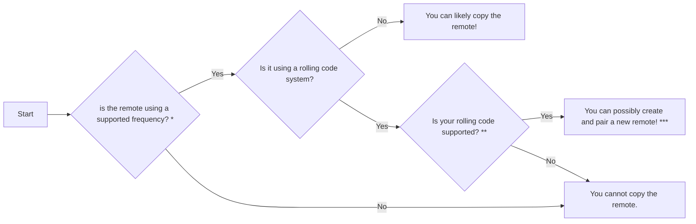

# Frequently Asked Questions
This page aims to collect frequent or common questions people may have related to the Flipper Zero.

## Flipper Zero

### Is the Flipper Zero sold on Amazon or AliExpress?

**No**. 

^^Those shops are run by scalpers/unauthorized resellers^^, so you will be charged more money than the device is worth or potentially scammed. 

Additionally, you **will lose your device's warranty** by buying from these shops. 

See the **[offical Flipper Zero how to buy site](https://flipperzero.one/how-to-buy)** for trusted sellers. 

### What can the Flipper Zero do?
All of the cool things the device can do are nicely laid out in the [**official docs**](https://docs.flipper.net)!

### Should I ask ChatGPT or other AI tools about Flipper Zero?
**Please do not ask AI tools about the Flipper Zero or development on it**. Due to the fact that the Flipper zero is such a unique device, these tools ^^***almost always are guaranteed to get the information wrong***^^. In our extensive testing it ***CANNOT*** be relied on for any information, whether thats seller information or development information or code. Please instead seek information from the [official product site](https://flipperzero.one).

??? tip "protip" 
    chatgpt is cringe bro. Do your own research fr.

### Will this device make me a super cool hacker so I can hack my entire city?
**No.** This devices is geared for educational use to learn about tech, not for you to be a menace to society. TikTok and Instagram videos love to lie about its features, so you will be disappointed if you're buying based on that. 

**Go and re-read [what flipper zero can do](https://docs.flipper.net)**.

Also keep this in mind:

{ width="600" }

### Can I use a Flipper Zero if I have a Chromebook?
Yes, however you will be limited to only using [Flipper Lab](https://lab.flipper.net) due to the security restrictions chromebooks have. qFlipper, and by extension the DFU recovery process, will *not* be avaliable on a chromebook. 
See this [troubleshooting article](troubleshooting.md#qflipper-returns-permission-denied) for more info. 

### Where Do I Get Cool Stuff for my Flipper Zero?
Nearly anything for the device is available on GitHub. 

* The [Awesome Flipper repo on GitHub](https://github.com/djsime1/awesome-flipperzero/tree/main) has a huge amount of links and info.
* [UberGuidoZ](https://github.com/UberGuidoZ/Flipper) has a number of random signal recordings.
* The [IRDB repo](https://github.com/Lucaslhm/Flipper-IRDB) contains a large assortment of infrared remotes.

### How do the Flipper Zero levels work?
From the [Official Documentation](https://docs.flipper.net/zero/basics/dolphin#fi-EA):
> Your digital pet earns XP every time you use your Flipper Zero. The amount of XP earned depends on the features you use. Keep in mind that you can only collect a maximum of 20 XP per day for each application, and a total of 140 XP overall per day. Collect 300 XP to reach Level 2, and 1800 XP to reach Level 3.

### Can the Flipper Zero copy any RFID card?

No. NFC/RFID is a broad and more complex topic. There are different card/tag types and Flipper can not read or emulate all of them. Some are protected with passwords. Some can be cracked, some can't. Some cards can only be read partially. Emulating partial info may not result in the reader accepting the signal.

The supported types and what can be read can be found in the docs: 

  - [https://docs.flipper.net/nfc/](https://docs.flipper.net/nfc/)
  - [https://docs.flipper.net/rfid](https://docs.flipper.net/rfid)

### How can I make NFC files with links or other things?
You have three options to create a NTAG type card with this info:

#### Web Based

- [Flipper Tools](https://nfc.flippertools.net/)
- [Flipper Maker](https://flippermaker.github.io)

#### App based
If your phone supports NFC, you can use the NFC Tools app on [Android](https://play.google.com/store/apps/details?id=com.wakdev.wdnfc&hl=en_US) & [IOS](https://apps.apple.com/us/app/nfc-tools/id1252962749).

This app can allow you to create all manner of records for the NTAG NFC file. 

To use it, create a new blank NTAG on your Flipper Zero, emulate the blank tag, then have your phone write to that tag. 

### Can I take my Flipper Zero on an airplane?
It's completely fine to travel with your Flipper Zero to any country the device is sold in. In case you are going on an airplane and through security, here's a few tips on what you should do:

* Turn the device off and treat it like any other electronic device in your carry-on bag.
* If asked, do not lie. Tell them that the device is an electronic multi-tool.
* After landing and before using your Flipper Zero in your destination country, make sure to update via qFlipper. That way, the frequency restrictions will be updated to that country's laws and regulations.

A lot of people have flown with and passed security checks with Flippers on them before, there haven't been any reported incidents. 

### Can Flipper Zero read Credit/Debit cards?
**No, you cannot use Flipper Zero to emulate your bankcard.**  These cards are protected by encryption.

While the Flipper Zero used to show some public details of the card in release 0.81.1, this was later removed due to confusion from both people and companies that caused them to think the Flipper Zero might be able to 'skim' bank cards. The information the device was reading was just the unencrypted part of the card. All actual payment related functions are encrypted on the card and are impossible for the Flipper Zero to read. 

### Can Flipper Zero emulate travel passes / bus passes?
**
DO NOT ATTEMPT. This will likely be considered FRAUD!
** 

**Do not try to copy & emulate a transport card!** This is a good way to end up with at *minimum* being banned from a transportation service, or at worst <u>criminal charges</u> if you attempt to actually use your Flipper Zero in place of a transportation pass. 

All it takes is a single report to authorities that you are not using an approved pass and you will have *massive* problems. 

### What cool modules should I buy with my Flipper Zero. 

It's typically recommended to just stick with the basics (Flipper Zero + optional Wi-Fi development board) until you learn what you're doing and what things you *want* your device to do. 
Otherwise, its likely that whatever you buy will just end up in a drawer gathering dust after a few days because you don't have any good uses, or worse: because you don't know how to set up the module. 

If you know what you want, a few popular module overviews are listed in the [GPIO page](gpio-overview.md#popular-modules)

### Can Flipper Zero copy car remotes?

!!! Warning
    Attempting to clone car remotes will fail and can lead to a **VERY expensive mistake!**

Short answer: **No.** Car remotes typically use rolling code to prevent copying to generate new codes each button press. Any attempts may cause the remote to desync, likely requiring an expensive trip to the dealer to fix your remote.

The Flipper Zero does not support the cloning of any rolling code automotive remote. 

See [this site](https://harryli0088.github.io/rolling-code/) for an example of how the basics of rolling codes work.

### Can Flipper Zero copy garage remotes?
Maybe! Refer to the chart below:

* [Supported Frequencies](https://docs.flipper.net/sub-ghz/frequencies)

** [Supported Rolling Codes](https://docs.flipper.net/sub-ghz/add-new-remote#3iGlU)

*** [Creating and pairing a new remote](https://docs.flipper.net/sub-ghz/add-new-remote)
