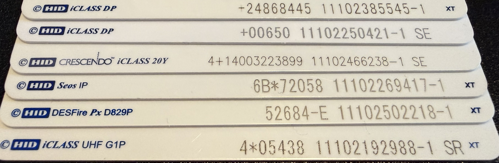

# HID iClass Guide
This is a guide to **reading & writing to HID iClass cards** with your Flipper Zero.

## Download Apps
- [**PicoPass App:**](https://lab.flipper.net/apps/picopass/) - Use this application to read iClass cards, and preform NR-MAC attacks for iClass SE 
- [**Seader App:**](https://lab.flipper.net/apps/seader/) - Use this application to read iClass SE and SEOS if you have a HID SAM or a SAMAdams

## Which card type do I have?

Use the chart below to determine which card type you have.

**Card Types**

 - **Card 1**: Legacy iClass (note the lack SE or SR after the numbers)
 - **Card 2**: iClass SE (note the SE after the numbers)
 - **Card 3**: iClass SE - Crescendo (note the SE after the numbers and the Crecendo before iClass)
 - **Card 4**: SEOS - **NOT** iClass at all, newer type of card than PicoPass supports. See [**HID SEOS**](https://flipper.wiki/nfc-overview/#hid-seos) for more information. 
 - **Card 5**: HID DESFire - **NOT** a iClass credential, this is a HID Mifare DESFire card.
 - **Card 6**: HID iClass UHF SR Variant (note the SR after the numbers and the UHF after iClass)

 - **Note**: There is another card type that's not listed in the photo above. Instead of SE/SR, it has **ER**. These cards are iClass SE & custom programmed.

- If you have a fob, the metal tag on the back might have letters to the right of the numbers.

**"My Letters aren't there/rubbed off!"** 

- You can check by reading the card on the PicoPass app. 
      - If it says "SE enabled; Read Failed; Auth Failed" than it's a iClass SE card.
      - If it says 26 bits/any other length (eg 36, 42) and no +SIO under, and "Key: Standard" you have a Legacy iClass credential with regular keys.
      - If it says 26 bits/any other length (eg 36, 42) *and* +SIO under, and "Key: Standard" you have a iClass SR credential with standard keys.
  - If it says "Read Failed; Auth Failed" and *not* SE enabled above, you have a Elite Key locked Legacy or SR credential. The only way to tell the difference between them is preform a NR-MAC or Loclass attack.

## How To Read Cards
 - For iClass Legacy:
    - Open the [**PicoPass**](https://lab.flipper.net/apps/picopass/) app on your Flipper Zero. Click *Read* and present your iClass credential to the back of the flipper.
 - For iClass SR:
    - Same proccess as iClass legacy, but there is a "+SIO" on the post-read screen, as the SR variant holds more data. The Flipper will still emulate this, but the SIO is tied to the CSN, so you will have to attempt a downgrade attack to put it on a actual card.
 - For iClass SE:
    - When you read the card in the PicoPass app, it should say "Read Failed; Auth Failed." To read the data (NOT write) move to the [**"NR-MAC Attacks"**](https://lab.flipper.net/apps/picopass/) section of the PicoPass app. 
    -*Note:* If you save the iClass SE credential and open the saved file, there is a chance you will be able to emulate the credential on non-updated readers that may not have the patch installed.

**Elite Cards**

"But my card is a Legacy/SR and I can't read it!"

This means your credential is **Elite.** Your credential is locked to a non-standard key that the Flipper attacks. Look at the [**Loclass**](https://lab.flipper.net/apps/picopass/) and the **Elite Keygen Attack** sections of the PicoPass app listing to preform the attack and possibly get the key for the card.

If neither of those options work, you can try the [**"NR-MAC Attacks"**](https://lab.flipper.net/apps/picopass/) as a last resort to read the card's data.

**Downgrade Attacks**

Depending on your card type (either iClass SE or SEOS), you might be able to preform something called a Downgrade Attack.

 - Some readers support multiple technologies, so the important data in iClass SE/SEOS cards can be put into a different format/protocol, but treated the same by the reader. A key part of this is determining if the reader has the target technology you want enabled.
    - iClass SE/Seos -> iClass (legacy): Check out this [information](<https://github.com/RfidResearchGroup/proxmark3/blob/master/doc/hid_downgrade.md#verfiy-reader-has-iclass-legacy-enabled>) for how to determine if this might work on GitHub.
    - iClass (legacy) -> LF RFID (t5577): Test if the reader has 125khz enabled with [RFID detector](<https://lab.flipper.net/apps/nfc_rfid_detector>) and use [picopass](<https://lab.flipper.net/apps/picopass>) to "Save as lfrfid".

## Writing

 - To write to iClass cards, you must have the following:
      - A iClass card of the same type to write to with standard keys/Elite keys the Flipper has saved
      - *Disclaimer: You **CANNOT** write to iClass SE cards*
      - PicoPass will *only* work with genuine iClass cards, and not Mifare Classic or any other 13.56 mHz cards. They **must** be iClass.

## More iClass Info

If you'd like to learn more about HID cards and iClass, check out [**this markdown file**](https://gist.github.com/bettse/36f25f9a2fcca74d773587cc8e780766)

## Any Questions?

Feel free to ask in **#nfc** in the Flipper Devices Discord Server, or the **#iClass** channel in Iceman's RFID server.
