# Flipper Animation Guide : meta.txt settings

Guide credited to Kuronons

*"I got myself a Flipper Zero to learn coding... and ended up making pixel-art. Life... ya never know..."*

Indepth guide to the meta.txt file settings which is used to set all the parameters of a Flipper Zero animation. 

!!! note
    For better visualization and understanding, I am using a custom firmware that allows to hide the top status bar border as well as top status icons to provide suitable screenshots.


## 📄 meta.txt : content overview
Below an example of a meta.txt file content. (from Flipper Zero [L1_Cry_128x64](https://github.com/flipperdevices/flipperzero-firmware/tree/dev/assets/dolphin/external/L1_Cry_128x64) animation)
Meta is pure text file (.txt) and can be opened/edited via any text editor (such as *Notepad*).

I colored in purple the part that is mandatory, in green what is optional (only applies if **bubbles** are used) and in white the data filled by the user.

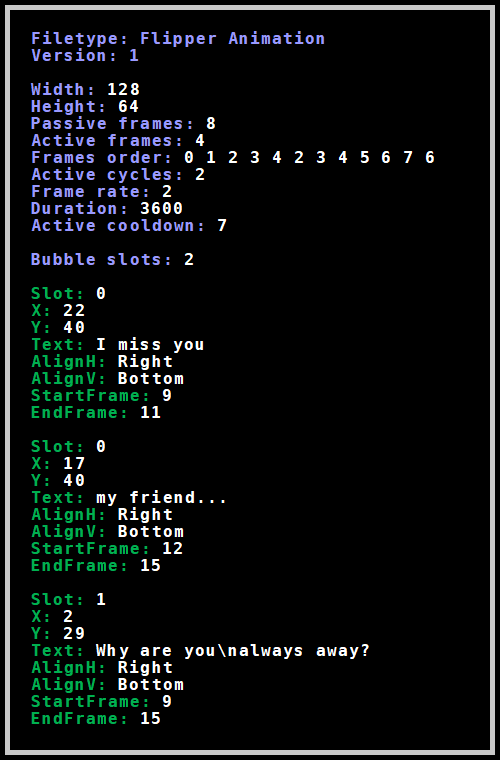


## 🐬 Flipper Zero official documentation : meta.txt
*Flipper Devices* provides basic information about meta file in their Github repo.
The following (here collapsible) content can be found in [flipperzero-firmware/assets/dolphin/readme.md](https://github.com/flipperdevices/flipperzero-firmware/blob/dev/assets/dolphin/ReadMe.md#file-metatxt)
??? quote "🔹 Definition & Header settings"
  
    - meta.txt : Flipper Format File with ordered keys.
    - Header:

    ```
    Filetype: Flipper Animation
    Version: 1
    ```
??? quote "🔹 Animation dimensions settings"
  
    - `Width` - animation width in px (<= 128)
    - `Height` - animation height in px (<= 64)
??? quote "🔹 Frames ordering"

    - `Passive frames` - number of bitmap frames for passive animation state
    - `Active frames` - number of bitmap frames for active animation state (can be 0)
    - `Frames order` - order of bitmap frames where first N frames are passive and following M are active. Each X number in order refers to bitmap frame, with name frame\_X.bm. This file must exist. Any X number can be repeated to refer same frame in animation.
??? quote "🔹 Animation settings"
  
    - `Active cycles` - cycles to repeat of N active frames for full active period. E.g. if frames for active cycles are 6 and 7, and active cycles is 3, so full active period plays 6 7 6 7 6 7. Full period of passive + active period are called *total period*.
    - `Frame rate` - number of frames to play for 1 second.
    - `Duration` - total amount of seconds to play 1 animation.
    - `Active cooldown` - amount of seconds (after passive mode) to pass before entering next active mode.
??? quote "🔹 Bubbles settings"
  
    - `Bubble slots` - amount of bubble sequences.
    - Any bubble sequence plays whole sequence during active mode. There can be many bubble sequences and bubbles inside it. Bubbles in 1 bubble sequence have to reside in 1 slot. Bubbles order in 1 bubble sequence is determined by occurrence in file. As soon as frame index goes out of EndFrame index of bubble - next animation bubble is chosen. There can also be free of bubbles frames between 2 bubbles.

    - `Slot` - number to unite bubbles for same sequence.
    - `X`, `Y` - are coordinates of left top corner of bubble.
    - `Text` - text in bubble. New line is `\n`
    - `AlignH` - horizontal place of bubble corner (Left, Center, Right)
    - `AlignV` - vertical place of bubble corner (Top, Center, Bottom)
    - `StartFrame`, `EndFrame` - frame index range inside whole period to show bubble.
??? quote "🔹 Frame indexes vizualisation"
      
    - Understanding of frame indexes
    
    For example we have
    
    ```
    Passive frames: 6
    Active frames: 2
    Frames order: 0 1 2 3 4 5 6 7
    Active cycles: 4
    ```
    
    Then we have indexes
    
    ```
                            passive(6)            active (2 * 4)
    Real frames order:   0  1  2  3  4  5     6  7  6  7  6  7  6  7
    Frames indexes:      0  1  2  3  4  5     6  7  8  9  10 11 12 13
    ```


## 🎬 ANIMATION : Meta Main settings
### 🔸  Frame dimensions
The first two settings listed in meta.txt are :
- `Width:` being the frame measurement on the ***X*** axis, horizontal.
- `Height:` being the frame measurement on the ***Y*** axis, vertical.

Values ​​are in pixels and must strictly match the dimensions of the animation frames.
Since the Flipper screen can display 128x64 pixels, these would therefore be the max values.

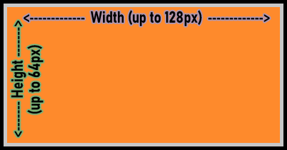

While most animations (from official Flipper Devices or custom makers) are made, for convenience mainly, on this frame size, one can choose to make an animation with smaller frames.

Official ***Flipper Devices*** firmware contains a bunch of animations that aren't 128x64px with values such as 128x51px or 128x49px.
Most of those are stored in flash memory (***internal*** & ***blocked*** anims) which makes sense in saving as much octets as possible due to the very low internal storage capacity. But even within the official ***external*** animations (those saved on SD), we can notice 3 (as of Nov. 24) that also use a reduced frame format.

For instance, the first frame of [L1_Laptop_128x51](https://github.com/flipperdevices/flipperzero-firmware/tree/dev/assets/dolphin/external/L1_Laptop_128x51), is (as its name specifies) only 51px high and will leave a 13px high unanimated area on top of the screen (blue-colored here) :

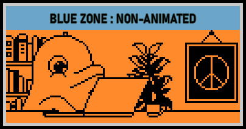

Frames are aligned on the BOTTOM LEFT corner without option to change that.
While it is not an issue at all when it comes to height (as the upper part of screen is mostly displaying the status bar and icons), it should be kept in mind when setting a width inferior to 128 as animation will be left-aligned.

For example, 64x32px frame position on screen :

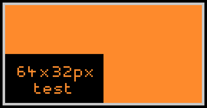

!!! warning
    Setting dimensions different from the actual bitmap image, while not causing the animation to fail, will result in a distorted display.
    Note that this will occur when compiling an animation with faulty meta values, but also when later editing the meta of an animation previously compiled with correct values.
    For instance, the very same 64x32px bitmap frame wrongly set to `Width:54` & `Height 22` and then to `Width:74` & `Height 42` :

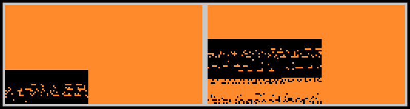

!!! tip
    ⮚ Animation frame must be set up to 128x64px
    ⮚ Width & Height values must match the pixel dimensions of the frames.
    ⮚ Those being defined in the meta, all frames of one animation must have the same dimensions.
    ⮚ Frames are bottom-left aligned.
    ⮚ Using frames of dimensions inferior to 128x64px makes only sense when editing an animation meant to be put in Flipper's internal memory. There would not be any significant impact for the ones stored on SD.


### 🔸  Passive & Active Frames : definition
Animation frames can be of 2 kinds : passive or active.

***Passive frames*** are the ones that are played in loop on Flipper idle screen.
An animation requires at least 1 passive frame to work.
Therefore, minimum value could never go under ***1***.
`Passive frames:` value defines the passive sequence by the number of frames that will be picked up from the ones listed in ***Frames order***.

***Active frames*** are the ones that are played once triggered/activated.
They have 2 possible triggers : Hitting the ***back*** button or coming back to animation screen from any other menu.
Once triggered the active sequence will start to play. (ie. It won't wait for the passive sequence to end)
An animation does **NOT** require active frame(s) to work.
If no active frame, value must be set to ***0***.
`Active frames:` value defines the activable sequence by the number of frames that will be picked up from the ones listed in ***Frames order***.

The sum of values of `Passive frames:` and `Active frames:` must equal to the number of frames listed in ***Frames Order***.

The use of active frames is of maker's choice. It provides to the user a basic level of interraction and can be designed in many artistic or playful ways.


### 🔸  Frames Order
`Frames order:` is used to define the sequences of passive and active frames.
It lists the frames by calling the bitmap files via their designed number. (ie the number between ***frame_*** and ***.bm*** in the file name : *frame_12.bm* = *12*)

Passive frames are always listed first. Active frames (if any) comes after.
As said, the total of inputs must be equal to the sum of `Passive frames:` & `Active frames:` values.

On top of that, each bitmap file must be listed at least once by its number.
As well, every listed input must refer to an existing bitmap file.

In the following example (simple passive/active animation with no frame repetition), we have 10 .bm frames numbered frame_0.bm to frame_9.bm.
6 first frames (0 to 5) are set are the *passive* ones while the 4 remaining ones (6 to 9) are set to *active*.

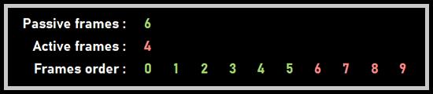

A bitmap file can be listed multiple times, and be counted multiple times in passive and/or active frames.
The frames order being the sequence(s) of bitmap displayed following maker's choice, it does **NOT** require to be a logical numerary suite (such as 1 2 3 4...) as long as it follows the requirements mentioned above.

Next example shows those. It uses frame repetitions in an animation built on only 5 .bm frames numbered frame_0.bm to frame_4.bm, without listing the frames in a "logical" numerical order.
We emphasize here that the number of active/passive frames is not related to the number of bitmap images, but rather to the number of calls of these in their respective sequences.

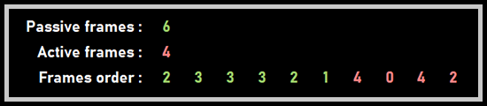

Still, trying to stick as much as possible to numeral order when it comes to name the bitmap files, accordingly to the position they should play within the animation, will greatly help building the ***frames order*** or editing it later (especially on long *frames order* listing 100+ inputs).

Labelling of bitmap files requiring the first frame to be named ***frame_0.bm***, the minimum input value in `Frames order:` is ***0*** in the case of a 1 only passive frame animation.


### 🔸  Active Cycles
`Active cycles:` value determines the number of time the active frames sequence will play in a row once triggered.

Once the the active period (ie the number of cycles of the active sequence) is over, animation will revert to passive one.

***Active cycles*** is a choice of design to limit the number of inputs listed in ***Frame order***.

If animation has no active frames (ie `Active frames: 0`), `Active cycles:` should be set to `0` too.
As well if animation contains active frames, `Active cycles:` should be set to at least `1`.
!!! warning
    If those values are not set accordingly, compiling the animation via `./fbt` (to make .png frames into .bm ones) **will definitely fail**.

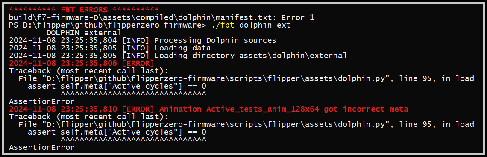

However, and against all odds (and logics), an already compiled animation ***should*** still be able to play on Flipper without failure.
For instance, `Active frames: 1` while there is **no** active frames : no noticeable consequences.
**But**, having `Active frames: 0` when there are active frames will make the animation unable to trigger the active sequence : only passive frames will play in loop even if the ***back*** button is pushed.

The number of frames that make up the ***active cycles*** above the first one are not counted as it in ***Active frames*** but will however be counted when it comes to ***bubbles***.


### 🔸  Frame rate
`Frame rate:` is the well known ***fps*** : Frames Per Second.
It defines how many frames will be played during 1 second.
!!! note
    Historically, theatre movie standard fps was set on 24.
    Drawn-animation however had usually a fps set to 12 and even lower (mainly due to production costs) such as 6 or 8 when it came to *Saturday Morning Cartoons* type animations.

Flipper will not be able to handle very high fps mainly due to hardware limitation (RAM size and display capability).
Flipper screen refresh rate being what it is, flickering or ghosting effect will occur if fps is set too high.
As well, Flipper firmware may crash on high ***frame rate*** if RAM is oversatured.

The usual working range of fps is 1-12, but it's not really recommended to have a frame rate above 8.
All original Flipper animations (external, internal, blocked and event the level-up ones) have their ***frame rate*** set to 2.

`Frame rate:` value must be an integer (number without decimal) and therefore cannot be less than 1.
As consequence, the slowest animation would be of 1 frame per second. Only way to have one frame to play longer on screen is to double its input in ***Frames order***.
The time each frame will play on screen is then calculated as follow : ***1 second divided by frame rate***.
For instance, a frame rate of 4 will make each frame play 0.25 second on screen.
Adjusting frame rate and playing with the inputs in Frames order makes visual acceleration or slow-down effects possible.


### 🔸  Duration
`Duration:` is used to determine the period of time one animation will run until it switches to the next random one.
Duration values are seconds.

By default, most animations have a duration value of 3600 which equals to 1 hour.

Duration is an underestimated setting that can be used to polish transitions in a suite of animations.
For example, having a total of 60 inputs in ***frames order*** and 2 as ***frame rate*** would result in a 30 seconds animation.
In order to play this animation 5 times entirely before it switches to the next, `Duration:` would be set to `150`.
This way, the switching will occur at the very end of the passive sequence instead of cutting it somewhere in the middle.

***Duration*** can also add some game aspect to a suite of animations.
It can be used with passive/active animations having identical passive frames but different active sequences.
Setting a duration of 10mn (600) for example will make the user curious about what will be revealed if he presses back as, whatever the animation of the set is playing, it would always be the same passive sequence looping on the screen.


### 🔸  Active cooldown
`Active cooldown:` is a delay, set in seconds, that will apply once an active period ends and during which the active sequence is not triggerable.
It forces passive frames to play during the defined time, temporarily disabling the back-button *active* trigger.

As well as for ***Active cycles***, if animation has no active frames (ie `Active frames: 0`), `Active cooldown:` should be set to `0` too.
As well if animation contains active frames, `Active cooldown:` should be set to at least `1`.
!!! warning
    If those values are not set accordingly, compiling the animation via `./fbt` (to make .png frames into .bm ones) **will definitely fail**.

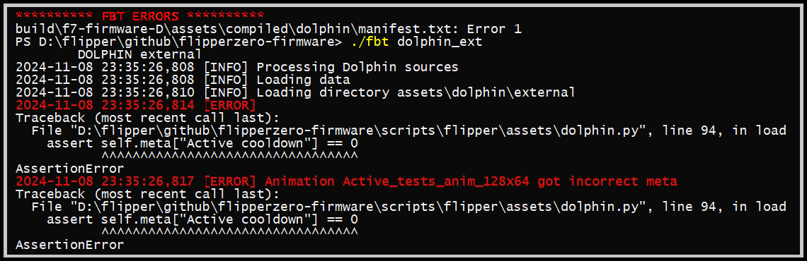

However, same as for ***Active cycles***, an already compiled animation ***should*** still be able to play on Flipper without failure.
For instance, `Active cooldown: 1` while there is no active frames : no consequences.
And same goes with `Active cooldown: 0` while there are active frames.


### 🔸  Bubble slots
`Bubble slots:` value indicates the number of bubbles "suites" that are listed to be randomly used during the active sequence of the animation.
It is not to be confused with the number of bubbles. A slot can have many bubbles within.
If there are multiple slots, each time active sequence is triggered, a slot will be randomly chosen and its bubbles sequence will be played.
Otherwise, if only if `Bubble slots:` is set to `1`, the suite will always play on active sequence.
If animation is not using any bubble, value must be set to `0`.
!!! warning
    `Bubble slots:` value **MUST** be set accordingly to the defined number of slots set below. Animation will fail otherwise and Flipper would most likely crash !

Since ***Bubbles*** is a complex subject in itself, its aspects will be reviewed in detail in the [dedicated section](#-bubbles--in-depth-guide) below.


### 🔸  Animation design : insight samples
* **The one-only frame "animation"**
1 bitmap frame (frame_0.bm) set as 1 passive with only its input once in ***Frames order***.
All active settings as well as bubble ones set to **0**. ***Frame rate*** set to minimum **1** as there is no meaning to have faster fps.
As a result we get an *unanimated animation*.
For those who want to have a static background image that will remain on screen as long as defined in ***Duration***.

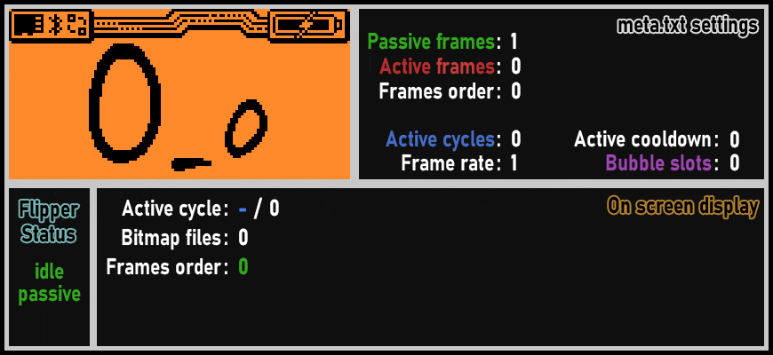


* **Passive-only animation**
This format is probably the most used by those who make custom animations by converting existing gif, movie or anime excerpt.
It will result in an only passive-framed animation that will play in loop until its ***duration*** ends.
One of the clever uses of this design is to create a seamless looping animation.
**Wr3nch**'s [X_X_F0Pattern](https://github.com/wrenchathome/flip0anims/tree/main/Animations/Flipper/X_X_F0Pattern) (inspired by the interior design of the Flipper Zero carton box) is a perfect example: it seamlessly plays 11 passive frames (numbered 0-10) in a loop.

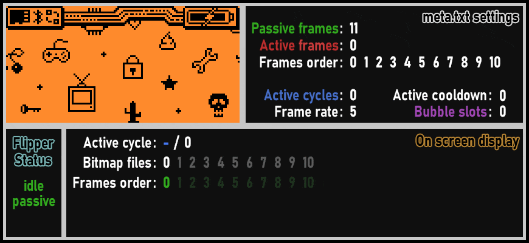


* **Passive/active animation : simple design**
Official [L1_Recording_128x51](https://github.com/flipperdevices/flipperzero-firmware/tree/dev/assets/dolphin/external/L1_Recording_128x51) is a good example of a basic passive/active animation.
Here we have a total of 12 bitmap frames (numbered 0 to 11).
They're listed in numerical order and only once in ***Frames order***.
The 6 first ones (0-5) are set as passive and the 6 others (6-11) as active with only 1 active cycle.

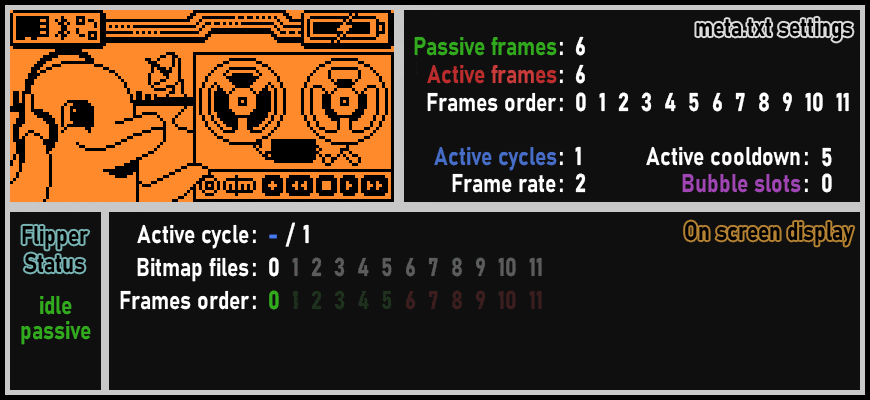


* **Passive/active animation : complex design**
Official [L1_Painting_128x64](https://github.com/flipperdevices/flipperzero-firmware/tree/dev/assets/dolphin/external/L1_Painting_128x64) is a more sophisticated passive/active animation.
While still having only 1 ***active cycle***, this animation is however using ***bubbles*** (2 on one slot).
This design allows an animation to extend its duration by using single bitmaps more than once.
With only 12 bitmap files, we end up with 22 inputs total in ***Frames order***.
It may be noted that creators of OFW animations usually have dedicated bitmaps for active and passive frames (here, respectively 0-5 and 6-11). This is not at all mandatory and is more of a design choice.

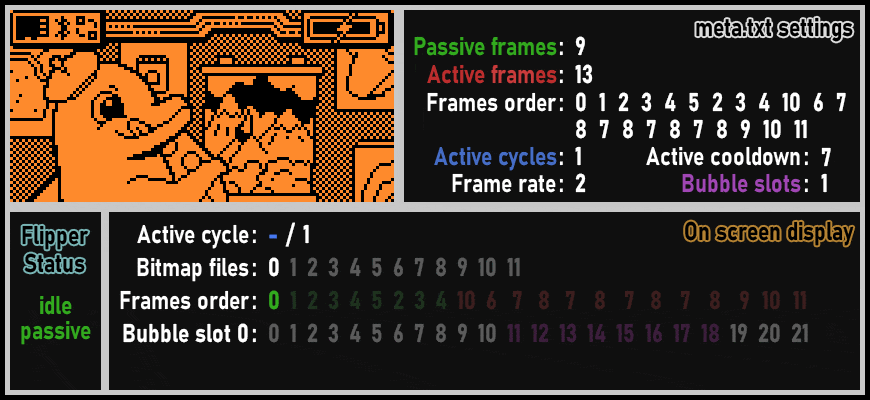


## 💬 BUBBLES : in-depth guide
‎
### 🔸  Bubbles : Definition
Bubbles are text inputs that will display as an additional layer above an animation, enclosed in coded-drawn lines in the spirit of comic book speech bubble.
It's important to mention that ***bubbles*** were originally designed to be used only in an active sequence.


### 🔸  Bubble slot
As previously mentioned, slots are suites of bubbles meant to randomly play during the active sequence of the animation.
`Slot:` value indicates which slot the bubble will be part of.
For instance, if slot #2 is randomly selected, only the bubbles being set to `Slot: 2` will play in the actual active sequence.
Next time the active sequence will be triggered, another slot will be randomly chosen.

As for frames, first slot is numbered `0`.

A slot can have multiple bubbles within so every bubble of the same sequence must share the same `Slot:` value.
Having only 1 bubbles slot (that will be labelled as **0**) will logically cut the random process and the bubbles sequence will always play when active one is triggered.
!!! warning
    ⮚ All bubbles inside a same slot must be listed together in a row, one after another before listing the next slot bubbles.
    ⮚ Only bubbles listed in a row under the same slot will display.
    ie. if you define Slot 0, first bubble, then Slot 1 first bubble and only then Slot 0, second bubble, this last one will not show up when Slot 0 will be randomly selected.

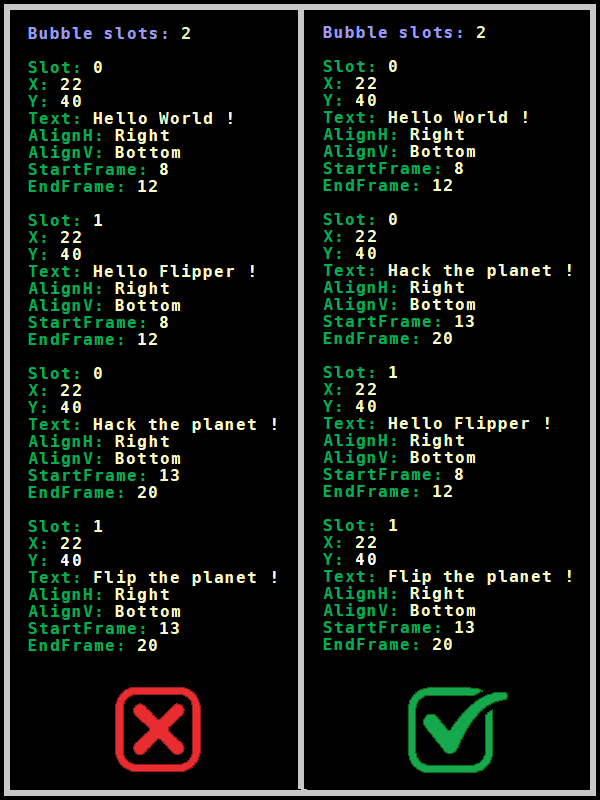


### 🔸  Bubble placement
Bubble placement on screen is defined by its upper-left corner coordinates.
Screen is  128x64px. First column (X - from left) as well as first line (Y - from top) are designed by **0**.
Coordinates will be set as :
- `X: ` = horizontal coordinate (values range = `0` to `127`)
- `Y: ` = vertical coordinate (values range = `0` to `63`)

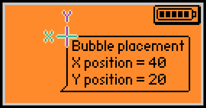

We will note that the bubble layer is not dependent of the animation frames size.
Bubble sticks to its screen coordinates and won't be affected in any way when displayed out the animation frames area as the following test shows (64x32px frames anim) :

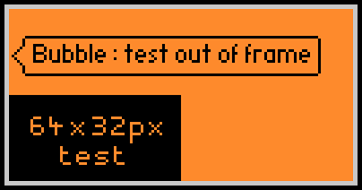

!!! tip
    The placement being only defined by the upper-left corner of the bubble, it must be thought in regards of those 3 factors :
    ⮚ Lenght of the longest text line for the X value.
    ⮚ Number of text lines for the Y one.
    ⮚ Postion of the [bubble tail](#--bubble-tail-positioning)

!!! warning
    A **negative value in X or Y** will result of a ***furi_hal error*** and would most likely put your Flipper in an **endless restart-loop !!**
    If it happens, just get the SD out and fix the meta by entering a positive value.
    If you don't have an SD card reader, take the SD card out and re-insert it again without passing the SD welcome splash-screen.
    It will allow you to overwrite the non-functioning meta via qFlipper files management.


### 🔸  Bubble text line
The displayed text of the bubble is defined by the eponymous function :
- `Text: ` followed by the text to display. Note that the part of the text lenght that would be out of the screen will not be visible anyhow.

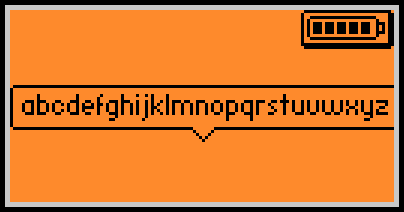

We see that a bubble can barely fit the 26 lowercase letters of the alphabet.
Depending on text input, it's a matter of testing to check if it fits or not.

To have multiple lines within the same bubble, `\n` can be used to define **newline**.
Next line first word should be written directly after the function. (no space in between).

An input such as `Text: First line\nSecond line\nThird line\nForth line\nFifth line` would render as :

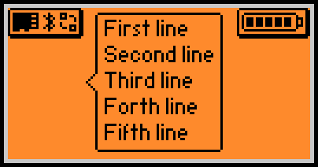

We note that we can only have **up to 5 lines** that would properly show on screen.
Of course, this will be dependent of the bubble placement and some lines can be displayed out of screen depending on `Y` value.
(`Y` must be set between 0 and 5 to be able to have 5 lines of text as well as the bubble outline in its whole displayed)

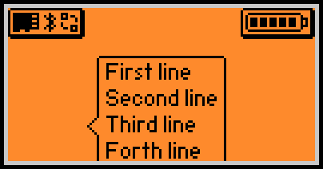

Same goes with too many lines. Only fully displayable lines are shown.
If we set the `Y` at its minimum value (0) and set the text on 6 lines :
`Text: First line\nSecond line\nThird line\nForth line\nFifth line\nSixth Line`
we end up with this result :

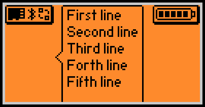

!!! tip
    ⮚ A maximum of 5 lines of text in a bubble using the `\n` function.
    ⮚ A maximum of 20-30 characters (spaces included) on a line.


### 🔸  Bubble tail positioning
The positioning of the tail (the bubble pointer) is set by those 2 functions and their applicable options :
- `AlignH: ` = **H**orizontal **Align**ment (Options = `Left`, `Center`, `Right`)
- `AlignV: ` = **V**ertical **Align**ment (Options = `Top`, `Center`, `Bottom`)

As a result we have 9 (3x3) possible placement of the tail : 


We note that having both `AlignH` & `AlignV` set to `Center` results in hiding the tail.

The coded outline of the bubble is not dependent of the animation background and will remain black even on top of a black background, and as consequence will not be visible :

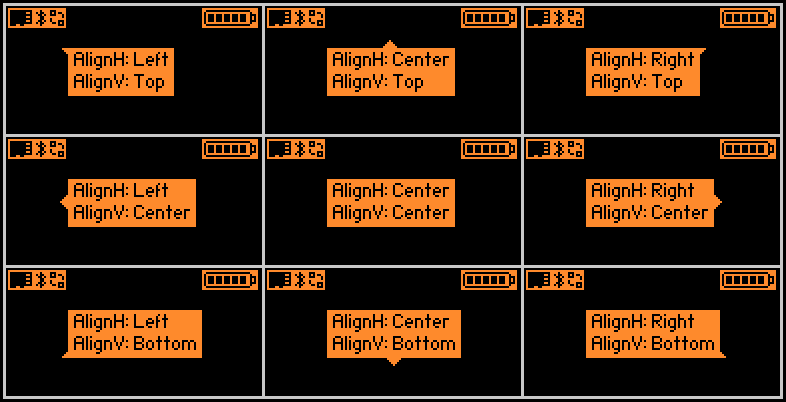

It then renders slightly more squared as the rounded-angles of the outline are not visible.

!!! tip
    Use `AlignH: Center` **+** `AlignV: Center` to have no bubble tail.


### 🔸  Bubble coordinates & Tail positioning issues
Here comes the tricky part :
If you set a tail to be visible, in order to be correctly displayed on screen, its design ***in its whole*** must be set to fit on the screen. Otherwise, you will face some strange behaviours.

Tails are adding a 4 pixels design on the edge of the bubble they're placed on.

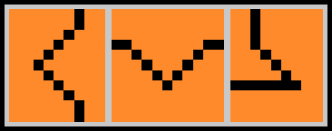

To allow a tailed-bubble to be displayed on screen without issue, bubble coordinates values must be set taking into account those additionnal 4 pixels.
!!! warning
    Issue will occur if there are less than 4 pixels between the screen's **left** or **top** border and the tail.

Since a picture is worth a thousand words, let's see how it behaves if we define a bubble with insufficient space on the edges for its tail to be displayed correctly.
In the following tests, we will set different bubble coordinates so that it lacks 1 single pixel to allow the tail to be fully displayed.
Again we will test with both white (orange) and black backgrounds as it helps to understand what is drawn on screen.

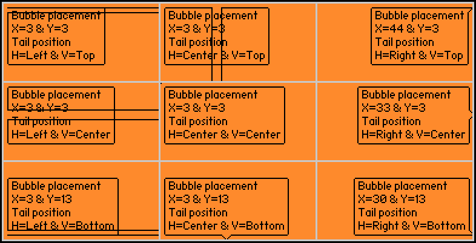

It enlights that issues occur when there is not enough space on TOP and/or LEFT screen sides to display the tail, creating some *backdraft* tail that displays over the text.
We note that, apart for just displaying what fits the screen, there is no particular issue with BOTTOM or RIGHT sides of the screen.
We will also note that, despite there is no tail to be meant to be shown on middle screenshot (`AlignH` & `AlignV` both set to `Center`), it still creates, for some reason, a single and unwanted pixel dot in the upper-left corner.

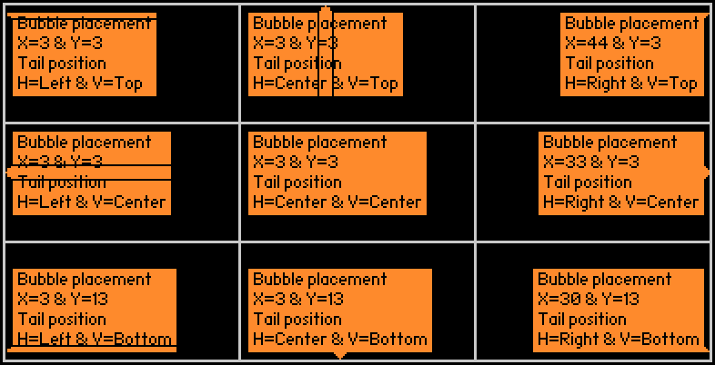

Black background allows to enlight that the tails themselves are correctly drawn and that the issue is only on their outlines.

Testing on a single-line bubble makes even weirder result 👀 :

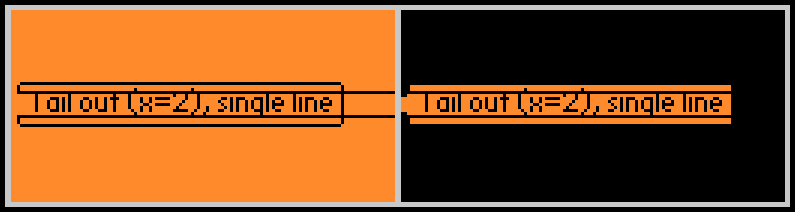

!!! note
    It's important to mention that those strange artifacts are just visual bugs and won't make Flipper to crash.
    One could decide to use those strange tail behaviours in some artistic way... 

!!! tip
    When ***bubble*** is a layer above the ***animation*** one, main screen ***status bar*** and ***icons/battery*** are on layers above bubble one.
    ⮚ That must be taken into consideration to avoid having text partially covered by those.
    Ensure safe bubble coordinates and tail position accordingly.
    ⮚ It's safer/easier to set your bubble `X: ` & `Y: ` to at least `4` to ensure avoiding issue with tail.
    ⮚ If possible, set your tail position to the sides (or center) of the bubble that are furthest from the edge of the screen.


### 🔸  Start & End Frame
To define when a particular bubble is meant to play within a slot sequence, the following functions are used :
`StartFrame:` sets on which frame bubble starts playing
`EndFrame:` sets the last frame bubble is playing

Each value corresponds to the position of the frame on the total *Passive + Active cycles* sequence.
It means that it takes into consideration not only the frames listed in ***Frames order*** but also counts the possible remaining ***Active cycle(s)*** that come after.
⮚ As consequence a bubble can be set starting on an active cycle and ending on another.
!!! note
    While it wasn't designed for, a bubble can be set to play during the passive cycle.
    ⮚ However passive cycle will only play the first bubble of the slot and this one only even if additional ones have been set.
    ⮚ If multiple slots, passive cycle bubble will randomly change slot only when active cycle is triggered. It would remain on the same slot in loop otherwise.
    ⮚ If the `EndFrame` value is set incorrectly beyond the passive cycle last frame, it has no real consequence : bubble will stop playing on last passive frame. For instance if passive cycle contains 8 frames (0 to 7) and bubble is set to play from 5 to 12, it will only be played on frames 5 to 7.
    ⮚ It behaves exactly the same way on active cycle, bubble would play until last active frame.

As example, following animation has 8 passive frames (0-7) followed by 8 active ones (8-15) with a *passive* bubble (slot 0) set to display beyond passive cycle and an *active* bubble (slot 1) set to play beyond active cycle :

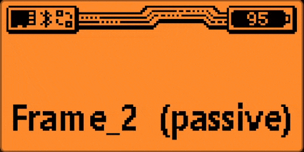

!!! warning
    A slot with a bubble set in passive cycle **will not** play the following bubbles even if set in active cycle.

!!! tip
    To have passive + active bubbles playing along, you must set those on different slots.
    For instance you can use slots 0 & 1 for passive and slots 2 & 3 for active.
    The limitation in this pattern is that you can't force a logical suite between passive and active cycle bubbles if you have more than one slot defined for each cycle.

**O_oV**
