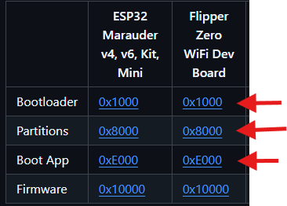
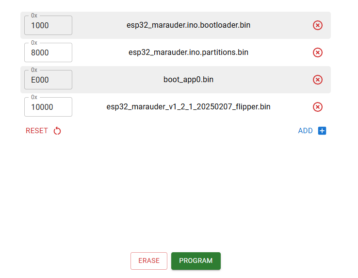
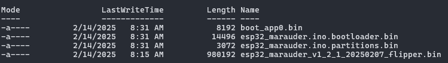

# Beginner's Guide To Installing Marauder On The Official Wi-Fi Dev Board For Use With The Flipper Zero
This guide aims to show how to set up and install Marauder onto the official Wi-Fi dev board for the Flipper Zero. 
In most cases, the steps will be similar for other ESP32 based boards, however you will need to select a slightly different firmware build version for your specific board. 

There are several different methods listed below to flash the board, ranked in order of complexity.
**You only need to select one method.**

The general steps are:

1. If you are running Windows, install the drivers under [Prerequisites](#prerequisites)
1. choose ^^one^^ connection method under [Connection Methods](#connection-methods)
1. Choose ^^one^^ method to flash it under [Flashing Methods](#flashing-methods)
1. Install the [Marauder companion app](#installing-the-marauder-companion-app)

## Prerequisites

### Windows
- install the [USB-Uart drivers from SiliconLabs](https://www.silabs.com/developer-tools/usb-to-uart-bridge-vcp-drivers)
    1. Extract the zip file you downloaded
    1. click the CP210x VCP Windows item
    1. Run and Install *CP210xVCPInstaller_x64.exe*

### Connection Methods
Decide how you can connect to your board. There are two choices:

- [Direct Connection](#direct-connection)
- [Flipper Zero GPIO Connection](#flipper-zero-gpio-connection)

---


#### Direct Connection
Plug in the USB cable directly to the Wi-Fi dev board. 

----
#### Flipper Zero GPIO Connection

1. Insert the Wi-Fi board into the Flipper Zero
1. Plug the USB cable into the Flipper Zero directly
1. On the Flipper Zero, choose GPIO -> USB-UART Bridge

Once you've decided on one of the above connection styles, proceed to [Flashing Methods](#flashing-methods). 

## Flashing Methods
The methods listed below are ranked from least to most complex.
Choose only ^^**one**^^ method from the list below: 

- [Method 1: FZEE Flasher](#method-1-fzee-flasher)
- [Method 2: ESP Web Flasher](#method-2-esp-web-flasher)
- [Method 3: ESPtool](#method-3-esptool)

### Method 1: FZEE Flasher
This tool is probably the simplest of all the methods, as it handles most of the complexity for you.

Requirements: Webserial capable browsers such as **Google Chrome** or **Microsoft Edge**. Firefox and Safari are **NOT** supported. 

1. Put the Wi-Fi board in flashing mode:
    1. Hold the **BOOT** button on the board.
    1. While continuing to hold the **BOOT** button, press and release the **RESET** button for one second. 
    1. Wait 5 seconds, then release the **BOOT** button. 
1. Navigate to the [FZEE Flasher site](https://fzeeflasher.com)
1. Click **Connect**
1. Depending on your connection style chosen above, you will see one of these two options to connect to in a new pop up window:
    - ESP32-S2
    - Flipper *flipperNameHere*
1. Click one of those two connections and hit the connect button
1. The text log should identify you board, in this case the official board should be detected as `Chip type ESP32-S2`
1. At the top of the site under `--- Select Board ---`, choose `Flipper Dev Board` if you are using the official Wi-Fi board
1. Under `--- Firmware ---`, choose `Marauder`
1. Under `--- Version ---`, choose `latest`
1. Click the **PROGRAM** button on the site and wait a few minutes for completion
1. If all goes well, you should get the message `---> FLASHING PROCESS COMPLETED!`
1. Press and release the **RESET** button on the Wi-Fi board

The board should now be ready to use with the [Marauder companion app](#installing-the-marauder-companion-app). 

----

### Method 2: ESP Web Flasher
Requirements: Webserial capable browsers such as **Google Chrome** or **Microsoft Edge**. Firefox and Safari are **NOT** supported.

1. Navigate to the [Marauder releases page](https://github.com/justcallmekoko/ESP32Marauder/releases) and find the most recent version
1. under *Assets*, look for the file with the name that ends in `_flipper.bin` for the official Wi-Fi dev board
1. Click and download this file, saving it to somewhere you can find it
1. Navigate to the [Marauder Web Updater instructions](https://github.com/justcallmekoko/ESP32Marauder/wiki/update-firmware#using-spacehuhn-web-updater)
1. We will need to download and save the following files under the *Flipper Zero WiFi Dev Board* column and save them to the same area you downloaded the Marauder .bin file from earlier:
    1. Bootloader
    1. Partitions
    1. Boot App 
    
    
    
1. Navigate to the [ESP Web Tool](https://esp.huhn.me/)
1. Put the Wi-Fi board in flashing mode:
    1. Hold the **BOOT** button on the board
    1. While continuing to hold the **BOOT** button, press and release the **RESET** button for one second
    1. Wait 5 seconds, then release the **BOOT** button 
1. Click **Connect**
1. Depending on your connection style chosen above, you will see one of these two options to connect to in a new pop up window:
    - ESP32-S2
    - Flipper *flipperNameHere*
1. Click one of those two connections and hit the connect button
1. Once connected, load the firmware files as follows:
    1. 0x1000 slot: `esp32_marauder.ino.bootloader.bin`
    1. 0x8000 slot: `esp32_marauder.ino.partitions.bin`
    1. 0xE000 slot: `boot_app0.bin`
    1. 0x10000 slot: the file ending in `_flipper.bin` mentioned earlier

    

1. Click **PROGRAM** and wait a few minutes. 
1. If all goes well, the Output section should say `Done!`
1. Press and release the **RESET** button on the Wi-Fi board

The board should now be ready to use with the [Marauder companion app](#installing-the-marauder-companion-app). 

----

### Method 3: ESPtool
This method will utilize the official flashing tool from Espressif for flashing ESP32 based boards. 
Because the tool is python based, we can leverage a tool called `uv` for setting up a quick way to manage python tools even if you dont have or want to install python directly on your system. 

While esptool and uv work on all operating systems, we will use **Microsoft Windows 11** as the OS for the instructions below. 

#### Prerequisites
We will need to install the `uv` tool.

Simply open Powershell and run `winget install astral-sh.uv` and wait for the setup to complete.

#### Install Process
Once installed continue with the below instructions:

1. Navigate to the [Marauder releases page](https://github.com/justcallmekoko/ESP32Marauder/releases) and find the most recent version
1. under *Assets*, look for the file with the name that ends in `_flipper.bin` for the official Wi-Fi dev board 
1. Click and download this file, saving it into a folder called `marauder` for easy locating
1. Navigate to the [Marauder Web Updater instructions](https://github.com/justcallmekoko/ESP32Marauder/wiki/update-firmware#using-spacehuhn-web-updater)
1. We will need to download and save the following files under the *Flipper Zero WiFi Dev Board* column and save them to the same folder you downloaded the Marauder .bin file from earlier:
    1. Bootloader
    1. Partitions
    1. Boot App 
    
    

1. Open up Powershell
1. Run `wmic path Win32_SerialPort get DeviceID,Name` and wait 15-30 seconds to get a list of serial devices on your system
1. Unplug your Flipper Zero or Wi-Fi board from the USB connection and run the above command again, noting which connection disappeared
1. Plug your device back in to the USB cable and  note down the COM port number
1. Put the Wi-Fi board in flashing mode:
    1. Hold the **BOOT** button on the board
    1. While continuing to hold the **BOOT** button, press and release the **RESET** button for one second
    1. Wait 5 seconds, then release the **BOOT** button 
1. Using the COM port number you noted down, erase your board by doing `uvx --from esptool esptool --port yourComPortHere erase_flash`
1. You should get `Chip erase completed successfully`
1. Using the `cd` command, navigate into your `marauder` folder you made earlier that houses your firmware files
1. Using `ls` you should see 4 files, similar to these:
    
1. If you see these files, proceed to the run the below multi-line single powershell command, ^^replacing^^ `comX` ^^with your com port and^^ `esp32_marauder_xxx_flipper.bin` ^^with the actual name of your^^ `_flipper.bin` ^^file from step 1:^^ 
```
uvx --from esptool esptool --chip esp32-S2 `
--port comX write_flash -z `
0x1000 esp32_marauder.ino.bootloader.bin `
0x8000 esp32_marauder.ino.partitions.bin `
0xE000 boot_app0.bin `
0x10000 esp32_marauder_xxx_flipper.bin
```
1. Wait a few minutes for the command to complete
1. If successful, you should get `Hash of data verified. Leaving... Hard resetting via RTS pin...`
1. Press and  release the **RESET** button once on the Wi-Fi dev board

The board should now be ready to use with the [Marauder companion app](#installing-the-marauder-companion-app). 

??? note "Cleanup Tip"
    If you dont want `uv` sticking around on your system, cleanup is very easy.    
    Just run `uv cache clean` to clean up all temp files, then do `winget uninstall astral-sh.uv` to remove the tool entirely. 

----

## Installing The Marauder Companion App
The Marauder companion app is avaliable both on the Flipper mobile app and on Flipper Lab. 
It can be added to your Flipper Zero here: [https://lab.flipper.net/apps/esp32_wifi_marauder](https://lab.flipper.net/apps/esp32_wifi_marauder)

If you are unsure how to install applications on your Flipper Zero, see the [Official Documentation](https://docs.flipper.net/apps) on how to manage apps. 
