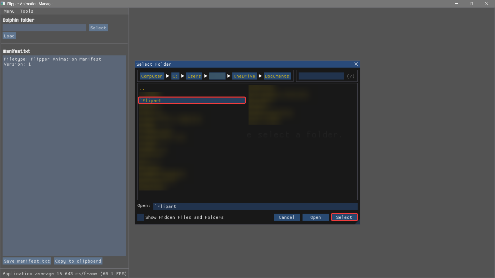
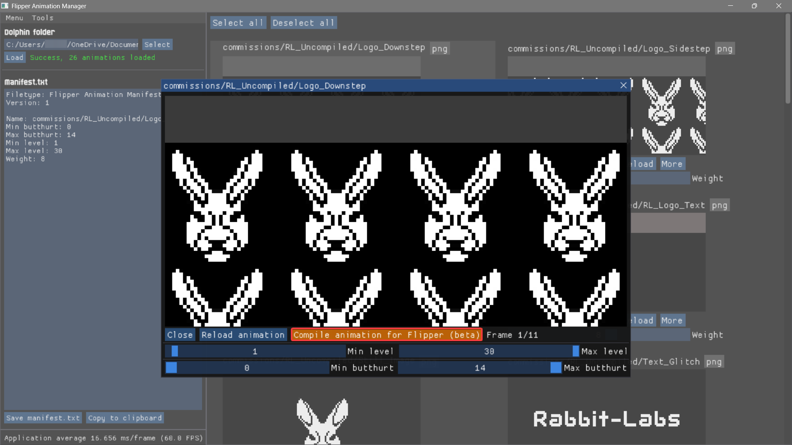
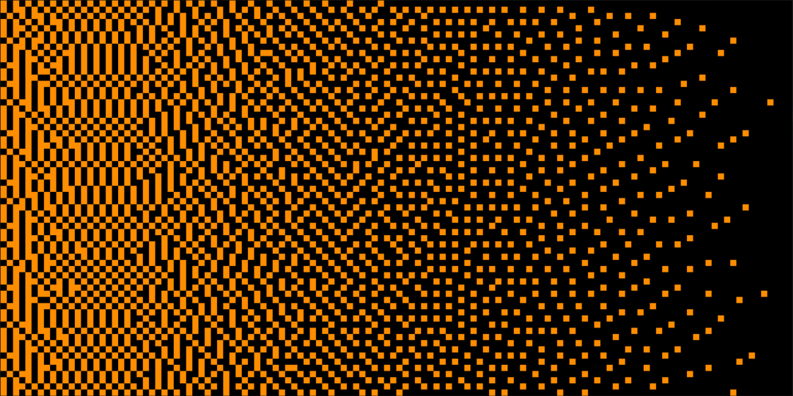

# Flipper Zero Asset Creation Tools Guide
A guide of all time that focuses on animation tools and how to get them working by [pr3](https://github.com/the1anonlypr3)!<br>
To suggest any changes to this doc, please contact me on Discord - my username is `pr3.`. 

## Glossary
??? "Click me for a glossary!"
  
    CLI:<br>
    Command-Line Interface: referring to your computer's `cmd`, `powershell` or `terminal`. This is used to input commands, namely when installing some compilers and their dependencies or compiling your animations with select compilers.
    <br><br>
    OFW:<br>
    Official Firmware. Any reference to the official firmware created by Flipper Devices.
    <br><br>
    CFW:<br>
    Custom Firmware. Any reference to custom firmware created by anyone other than Flipper Devices
    <br><br>

## I Need Software! 
You came to the right place! This guide will include explanations on what each art software accomplishes, it's pros/cons, and how to get it set up and compiling your animations!

!!! note
    This guide covers getting animation working for both **OFW** and **CFW**. If you're using a CFW, use one that follows your country's local laws. 

<br>

## What Software do I Use?
### ‣ Local Software
??? "1. Aseprite"
  
    - **A favourite among many pixel artists** - built for seamless pixel art and animation. 
    - **Streamlined user experience** - useful keybinds, key features, built in exporting feature meaning you won't need to use AntRenamer and built in tools for shapes, fill, dithering among others. Overall perfect all-in-one pixelart software. 
    - **FOSS** - you can buy it [on their site](https://aseprite.org), on [steam](https://store.steampowered.com/app/431730/Aseprite/), [build it yourself](https://github.com/aseprite/aseprite), or download v1.3.14.4 from [my repo](https://github.com/the1anonlypr3/pr3s_anim_haven/blob/main/software%20%5E-%5E/Aseprite-v1.3.14.4-x64.zip)! Do consider donating to the devs. 

??? "2. Adobe Photoshop"
  
    - **Professional paid tool** - much less user-friendly with a steep learning curve. 
    - **Phenomenal amount of features and support** - (although you don't need much for animation...), a solid streamlined workflow and consistent tools. Incredibly overkill if you're looking to just make Flipper animations; there's considerably better tools for this usecase created by better companies for cheaper.
    - <i>"Like driving an F1 car to the grocery shop"</i> - Kuronons

??? "3. GIMP"
  
    - [GIMP](https://www.gimp.org/downloads/) is essentially a FOSS version of Photoshop, with some holes.
    - Not much else to mention other than the fact it's a slightly clunkier free Photoshop with considerably less features. 

??? "4. Microsoft Paint"
  
    - **Terrible piece of software** - beyond clunky to use, especially for a usecase where you're constantly editing frames, previewing your animation and using keybinds for tools. 
    - **Zero user experience** - barely responsive, lack of keybinds, no animation previewer. Bare minimum of basic
    - **Don't even consider this software** - download a portable version of Aseprite, Photoshop or GIMP and hit the ground running.

### ‣ Web-Based Tools
??? "1. EzGIF"
  
    - [EzGIF](https://ezgif.com) is a web-based `.gif` editing platform, beyond useful for turning any `.gif` into a Flipper animation.  
    - [EzGIF](https://ezgif.com) is very effective at grabbing frames from a `.gif` and manipulating them with a handful of filters and settings if you don't want to spend much time custom-making an animation from scratch. Evidently, it lacks the features of a normal pixelart software. 
    - [EzGIF](https://ezgif.com) is a great site to start off animation, many people use it to make their first!

??? "2. Piskel"
  
    - [Piskel](https://www.piskelapp.com/) is a free, open source web and offline plaform for creating animations and sprites that is surprisingly well made for pixelart specifically compared to it's competitors. Easily the best in it's class for online pixelart. 
    - It works similarly to Aseprite - but web-based (go figure..), while including many of aseprite's useful tools, even managing keybinds for each.  

??? "3. Lopaka"
  
    - [Lopaka](https://lopaka.app/sandbox) is a close second to Piskel; another web-based art platform with premade display settings for the Flipper Zero/One among other devices, although you can only choose from preset canvas sizes. 
    - It includes many pre-made assets and icons that may be useful for app/UI development, less for animation.
    - Similar to Photopea, it's much better for small edits or creating menus since it lacks frame management. (although you'll likely be doing single frame edits in your dedicated art suite)

??? "4. Photopea"
  
    - [Photopea](https://photopea.com) is a web-based art platform similar to Photoshop. 
    - It's better for single frame editing, and catching those slight details. 

<br>

!!! note
    **Web-based software** can have noticeably more latency and lag compared to local software, and can lack in some features. However, the convenience still makes them somewhat useful for small edits.<br>

## I Chose a Software! What Now?
### ‣ Learn!
Now you create, experiment, and learn! [YouTube](https://www.youtube.com/) has some great tutorials from various channels and [Pinterest](https://pinterest.com/) is great for inspiration. Just searching ["pixelart"](https://www.youtube.com/results?search_query=pixelart) on YouTube can get you to many useful resources. Refer to the rest of this doc to find out how to compile your animation. 

### ‣ Contribute!
There's plenty of projects across [GitHub](https://github.com) that host animations and reference artists, such as [MomentumFW's Asset Pack Site](https://momentum-fw.dev/asset-packs) and other repos like [Kuronons' FZ_Graphics](https://github.com/Kuronons/FZ_graphics). Make a pull request, and get your art featured!

<br>

## Common Issues 
### ‣ File Structure: OFW
You won't have to worry about manually doing this, FBT handles this sort of thing for you if you're using custom animations. More on compiling with FBT later.
```
├── dolphin/
│   ├── blocking/
│   │   ├── L0_NewMail_128x51
│   │   ├── L0_xyz_128x51
│   │   └── L0_xyz_128x51
│   ├── external/
│   │   ├── L1_Akira_128x64
│   │   ├── L2_xyz_128x64
│   │   └── L3_xyz_128x64
│   └── internal/
│       ├── L1_BadBattery_128x47
│       ├── L1_xyz_128x49
│       └── L1_xyz_128x47
├── icons/
│   ├── About/
│   ├── Animations/
│   ├── Archive/
│   └── etcetera_etcetera/
├── protobuf/
└── slideshow/
```
!!! note
    Again, there's a high amount of folders left out for the sake of keeping this doc somewhat simple. See the [OFW `assets/` source code](https://github.com/flipperdevices/flipperzero-firmware/tree/dev/assets) for a full list of files. Again, to change asset files that haven't been listed, keep the file's folder name the same - just change the filename and let FBT handle file extensions. 

### ‣ File Structure: CFW
File structure is very important - without it, the Flipper can't understand how to display your animation, and you'll get errors left and right. This is more involved with CFW than OFW. 
An asset pack for a custom FW should look something like this:
```
Animation_Pack_Name/
    ├── Anims/
    │   ├── Animation_1/
    │   │   ├── frame_0.bm
    │   │   ├── frame_1.bm
    │   │   ├── frame_xyz.bm
    │   │   └── meta.txt
    │   ├── Animation_2/
    │   │   ├── frame_0.bm
    │   │   ├── frame_1.bm
    │   │   ├── frame_xyz.bm
    │   │   └── meta.txt
    │   ├── Animation_3/
    │   │   ├── frame_0.bm
    │   │   ├── frame_1.bm
    │   │   ├── frame_xyz.bm
    │   │   └── meta.txt
    │   └── manifest.txt
    └── Icons/
        └── Passport/
            ├── passport_bad_46x49.bmx
            ├── passport_happy_46x49.bmx
            ├── passport_okay_46x49.bmx
            └── passport_128x64.bmx
```
!!! note
    In the `Icons/` folder, there's significantly more customisation available, however if I listed it in the tree above we'd be here forever. Please refer to your firmware's source code to get the correct file and folder names. To change whatever hasn't been mentioned, keep the folder name the same as what's listed in the FW, and just change the appropriate filenames - Your compiler will handle file extensions for you. 

### ‣ Compilation
Sometimes using the wrong compilation software (particularly img2fbm) can render your frames unusable for the Flipper. Please choose from the tools listed below to mitigate errors and get your animations working! to debug your animation, go to [lab.flipper.net's CLI](https://lab.flipper.net/cli) and enter one of the below commands. Make sure qFlipper is closed!

| `log error` | `log debug` | `log trace` |
| ------------ | ------------- | ------------ |
| Lowest verbosity | Just-right verbosity  | Highest verbosity |
| Logs **just errors**. | Use this. Perfect amount of logs  | Overwhelming amount of logs |

### ‣ Logs
 - `Can't upload animation described in manifest: xyz`:<br>
 Flipper failed to load your animation. This could be due to incorrect file structure, incorrect/corrupt frames, `meta.txt` files or `manifest.txt`.
<br><br>
 - `Error loading animation: frames order`:<br>
 Self explanatory - an issue with your frame order in either of your animations. Tools such as [Ant Renamer](https://www.antp.be/software/renamer) are great for bulk renaming frames if you're not looking to manually change your frame order. Check your `meta.txt`'s frame order to make sure it's right - if you have one frame listed more than once, you need to add that to the `Passive frames: ` or `Active frames: ` count. e.g., `0 0 1 1 2 2 3 3` is 6 passive/active frames, not 3. 
<br><br>
 - `Failed to load animation bubbles`
 Self explanatory - Flipper failed to load your animation's speech bubbles. Make sure they're set correctly in your animation's `meta.txt`. [Kuronons' guide](https://flipper.wiki/tutorials/Animation_guide_meta/Meta_settings_guide/) explains how to use bubbles, although people usually manually draw them.

!!! note
    OFW animation services code is located [here](https://github.com/flipperdevices/flipperzero-firmware/tree/dev/applications/services/desktop/animations).

### ‣ File Contents
!!! note
    `*` = Required<br>
    `/` = Optional

 - `meta.txt`
```
Filetype: Flipper Animation             *
Version: 1                              *

Width: 128                              *
Height: 64                              * 
Passive frames: 5                       *
Active frames: 0                        /
Frames order: 0 1 2 3 4                 *
Active cycles: 0                        /
Frame rate: 1                           *
Duration: 3600                          *
Active cooldown: 0                      /

Bubble slots: 0                         /
```
!!! note
    Anything listed as `Optional` should be defined as `0`; **do not** remove the line. Passive frames are **required** - have at least one in your animation, or else it'll error. [Kuronons' guide](https://flipper.wiki/tutorials/Animation_guide_meta/Meta_settings_guide/) does a significantly better job at explaining `meta.txt`s than I do, and you should read up on it before creating one. 

 - `manifest.txt` 
```
Filetype: Flipper Animation Manifest    *
Version: 1                              *

Name: animation_xyz                     *
Min butthurt: 0                         *
Max butthurt: 14                        *
Min level: 1                            *
Max level: 3                            *
Weight: 8	                            *

Name: animation_xyz                     *
Min butthurt: 0                         *
Max butthurt: 14                        *
Min level: 1                            *
Max level: 3                            *
Weight: 8	                            *
```
!!! note
    `manifest.txt`'s settings are obviously entirely required. <br>
    `Min` and `Max butthurt` control the minimum and maximum `butthurt` the animation can display at - used for when you want to show certain animations depending on Flipper's mood. `0-4` butthurt levels are `Happy`, `5-9` is `Okay` and `10+` is `Angry`.
    <br>
    <br>
    Similarly to the `butthurt`, `Min` and `Max level` controls the minimum and maximum Flipper level the animation can display at - used for when you want to show certain animations depending on Flipper's level. For some CFW, maximum level may exceed OFW's maximum of 3 levels. 
    <br>
    <br>
    `Weight` just controls the chance of an animation playing compared to other animations. An animation with `Weight: 2` **will** statistically play less often than animations with `Weight: 3` and up. If you want an equal chance, just make each `Weight` the same number. 

<br>

## Viewing Your Animation
!!! note 
    [Ooggle's Flipper Animation Manager](https://github.com/Ooggle/FlipperAnimationManager) is **the** tool for previewing your creations. More on it's features below. Flipper **Animations** only take `.bm` files, compiled from `.png` files. *"How do I compile frames?"* I hear you ask?

### ‣ Compiling Frames

??? "1. Flipper Animation Manager"
  
    - [Ooggle's FlipperAM](https://github.com/Ooggle/FlipperAnimationManager) is a speedy well built FOSS previewer with a built in compiler, and a GUI. 
    - The perfect suite for viewing and compiling animations on the fly. Zero complaints. 

??? "2. asset_packer.py"
  
    - [WillyJL](https://github.com/Willy-JL)'s [asset_packer.py](https://github.com/Next-Flip/Momentum-Firmware/blob/dev/scripts/asset_packer.py) is a great quick and easy script for compiling asset packs for CFW. 
    - Easy to use once set up, and compiles blisteringly fast. I highly recommend this tool! 
    - May be hard to set up for someone new to `Python` and CLI in general. 

??? "3. FBT"
  
    - [Flipper Build Tool](https://github.com/flipperdevices/flipperzero-firmware/blob/dev/documentation/fbt.md) is a decent, but time consuming and generally overkill tool with a simple installation - just clone the [OFW repo](https://github.com/flipperdevices/flipperzero-firmware).
    - You'll **need** it if you want to compile animations for OFW.
    - TalkingSasquach has a [useful video](https://www.youtube.com/watch?v=trpcZLlJtNw&t=1601s) on compiling with FBT. Follow it if you're compiling for the first time. Although it's outdated, it covers other bases animation-wise as well. 

??? "4. img2fbm"
  
    - [img2fbm](https://github.com/atomofiron/img2fbm) although a convenient tool being drag n drop, it's very unreliable for creating frames. 
    - It sometimes makes useable animations, however you'll find other tools get the job done considerably better. 

<br>

## How do I Install/Use my Compiler?
??? "FlipperAM"
  
    - Please see [Ooggle's Guide](https://github.com/Ooggle/FlipperAnimationManager/wiki/Installation-Guide) on how to install FlipperAM to get it working on Windows, MacOS or Linux. 
    <br><br>
    Using the Software:<br>
    
     - Click select to see your file explorer menu. Make sure your asset pack is properly structured beforehand. 
    <br><br>
    
     - Navigate to your asset pack's path, click it's folder, and click `Select`.
    <br><br>
    
     - Now you can preview your compiled or uncompiled animations. Here I'm previewing compiled packs. 
    <br><br>
    
     - Uncompiled, you can click `Compile animation for Flipper`. This will make a folder `animationxyz_compiled`. 
    <br><br>
     - Replace `animationxyz` with `animationxyz_compiled`, and rename it if you'd like! now you have compiled frames in your pack. You can also make a new `manifest.txt` from the previewer after clicking an animation, and alter `Level` and `Butthurt`. 

??? "asset_packer.py"
  
    Usage:

    - Prepare a folder for the script and your animation. Doesn't matter where you put this folder - mine's on my desktop. <br>

    - Download the script directly from [WillyJL's Repo](https://github.com/Next-Flip/Asset-Packs/blob/dev/.utils/ext/asset_packer.py), and save it to the folder you just made. <br>

    - Open your terminal and install `python` with `winget install Python.Python.3 -e --accept-package-agreements` (Windows), `sudo apt install python3` (Debian-based Linux), or `sudo pacman -S python3` (Arch-based Linux)<br>

    - Install the required dependencies with `pip install pillow heatshrink2` (Windows, Debian-based Linux, Arch-based Linux)<br>

    - Put your correctly structured asset pack (see above section for file structure) in the same folder as the script, open a terminal in the folder you created earlier and enter `python3 asset_packer.py`.
    
    - If done right, the script will run and you'll see this prompt:<br>
    ```
    This will look through all the subfolders next to this file and try to pack them
    The resulting asset packs will be saved to 'asset_packs' in this folder
    Press [Enter] if you wish to continue
    ```
    - After pressing `enter`, your asset pack(s) will be compiled and ready to drag and drop into qFlipper. Good job!

??? "FBT"
  
    - See [TalkingSasquach's Animation Video](https://youtu.be/trpcZLlJtNw?si=vR213zHsS9ViaOOU&t=1580), which covers compiling with FBT. 
    <br>
    - Make sure you clone the OFW repo with `git clone https://github.com/flipperdevices/flipperzero-firmware` to use FBT. 

## Difference Between Compilers
!!! note
    Different compilers compile frames differently. Hence, for clarity, you should only be drawing using black and white pixels. 

- Uncompiled gradient:


<br><br>

- Gradient compiled with `asset_packer.py`:


<br><br>

- Gradient compiled with FlipperAM:


<br>

<p style="text-align:center;">made with ❤️ and 🔥 by <a href="https://github.com/the1anonlypr3">pr3</a>. thank you so much for reading!</p>