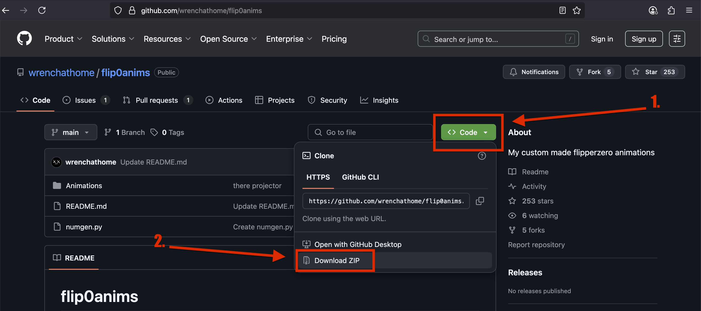
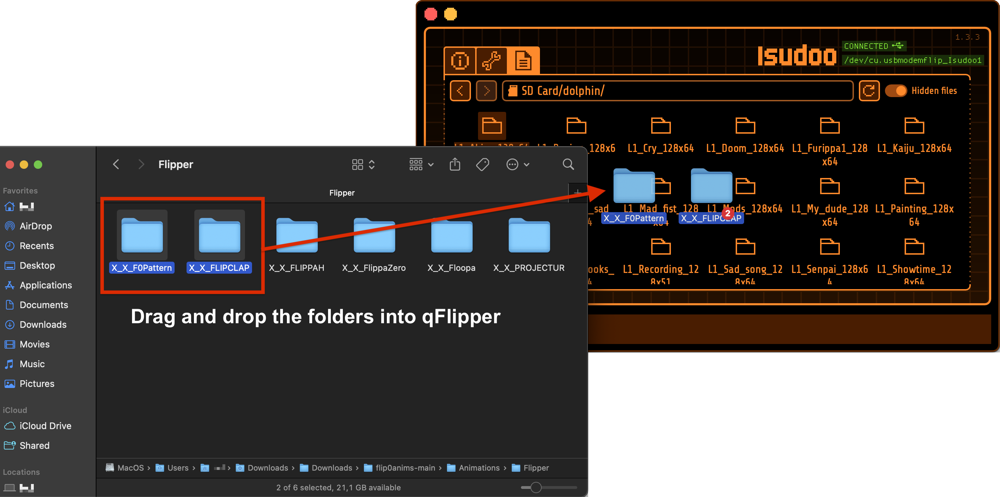
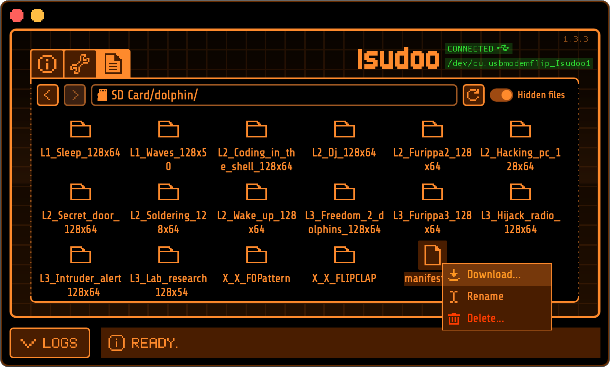

In this guide, you will learn how to add new animations to Flipper Zero.

---

### 1. Getting the Files
First, you need to download the animations to your local computer. Usually, they can be found on GitHub. 
For our example, we will take [Wr3nch's Flip0Anims repository](https://github.com/wrenchathome/flip0anims){:target="_blank"}.

In the repo, simply click on the green **"Code"** button and select **"Download ZIP"**:



!!! note "More Flipper Zero Animation repos from other creators:"
    - [Kuronons](https://github.com/Kuronons/FZ_graphics){:target="_blank"}<br>
    - [Topbillin](https://github.com/topbillin/animations){:target="_blank"}<br>
    - [LinusKay](https://github.com/LinusKay/flipperzero-animations){:target="_blank"}<br>
    - [Evillero](https://github.com/evillero/flipper_animations){:target="_blank"}<br>
    

### 2. Prepare Your Animation Folders

In this example, we will prepare the `X_X_FLIPCLAP` and `X_X_FLIPPATTERN` animations from the downloaded repo:

 

After the download has finished, extract the `flip0anims-main.zip` file. You will only need the folders of the animations you want to use. Find the `X_X_FLIPCLAP` and `X_X_FLIPPATTERN` folders in: `flip0anims-main > Animations > Flipper`.


!!! note "Note"
    Make sure each animation folder contains:<br>

    - The animation frames, numbered in order: `frame_0.bm`, `frame_1.bm`, and so on<br>
    - A [`meta.txt`](/tutorials/Animation_guide_meta/Meta_settings_guide/) file<br>

---

### 3. Copy the Folders to Your SD Card

Copy the animation folders into the following directory on your Flipper's SD card via qFlipper:

```
/SD Card/dolphin/
```


---

### 4. Getting the `manifest.txt` File


In qFlipper, right click the `manifest.txt` file and select the **Download** option. Save it to your computer so that you can edit it.



The contents of your `manifest.txt` file should look like this:
```
Filetype: Flipper Animation Manifest
Version: 1

Name: L1_Waves_128x50
Min butthurt: 0
Max butthurt: 5
Min level: 1
Max level: 3
Weight: 3

Name: L1_Laptop_128x51
Min butthurt: 0
Max butthurt: 7
Min level: 1
Max level: 1
Weight: 3

/* ...info on other animations continues... */
```

!!! note "Note"
    You can always re-download the latest version of the `manifest.txt` file from the firmware repository:
    [https://github.com/flipperdevices/flipperzero-firmware/blob/dev/assets/dolphin/external/manifest.txt](https://github.com/flipperdevices/flipperzero-firmware/blob/dev/assets/dolphin/external/manifest.txt){:target="_blank"}

---

### 5. Add New Animation Entries

For each new animation, add the following block to your `manifest.txt`:

```
Name: REPLACEME
Min butthurt: 0
Max butthurt: 14
Min level: 1
Max level: 3
Weight: 3
```

> Replace `REPLACEME` with the exact name of your animation folder.

!!! note "Note"
    Blocks can be added anywhere in the manifest, as long as they are separated by an empty line. For convenience, we recommend grouping them together at the start or end of the file.

In our example, we add 2x of those code snippets to the start of our file, and then change the two `REPLACEME`'s to `X_X_FLIPCLAP` and `X_X_F0Pattern` so it looks like this:
```
Filetype: Flipper Animation Manifest
Version: 1

Name: X_X_FLIPCLAP
Min butthurt: 0
Max butthurt: 14
Min level: 1
Max level: 3
Weight: 3

Name: X_X_F0Pattern
Min butthurt: 0
Max butthurt: 14
Min level: 1
Max level: 3
Weight: 3

Name: L1_Waves_128x50
/* ...info on other animations continues... */
```

!!! note "Tip"
    To test only your new animations, remove all other entries. Make sure to **back up the `manifest.txt` file first!**

---

### 6. Apply Changes and Upload the File to Flipper

Save your changes to the `manifest.txt` file, and upload it to the `/SD Card/dolphin/` folder on your Flipper Zero.

---

### 7. Reboot Your Flipper

Restart your Flipper. Your new animation should now appear!


!!! note "Note"
    On each boot, a random animation will be chosen. You can not select manually which animation will play.<br>
    
---

### Don't Lose Your Updates

The `manifest.txt` on your SD card gets replaced with each firmware update. Make sure to **back it up** before you install the latest version.
