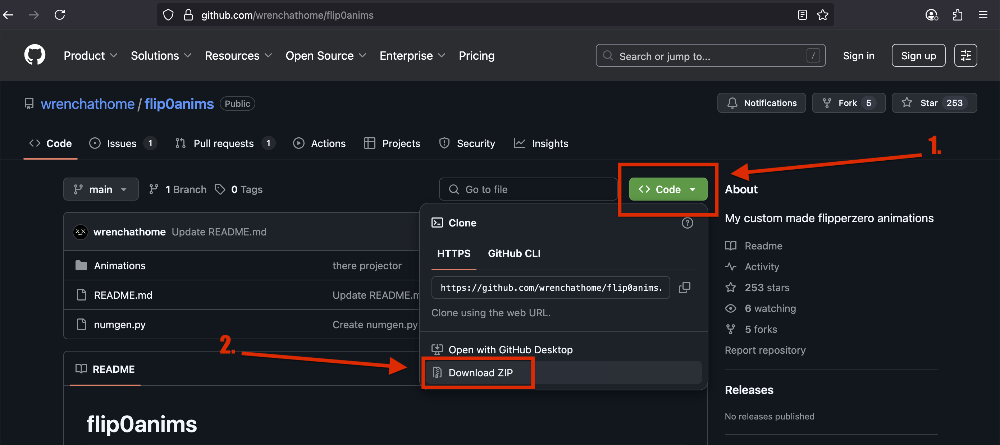
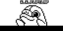
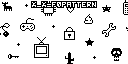
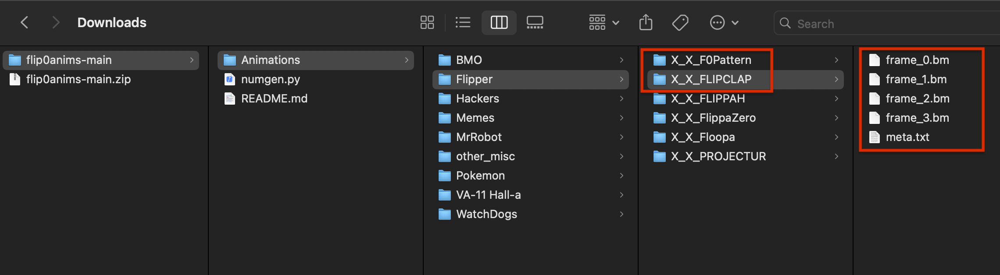
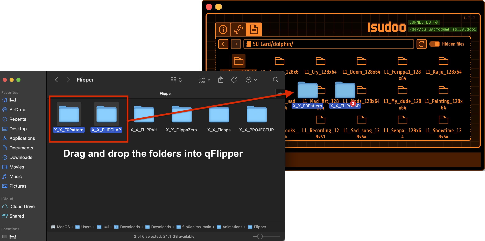
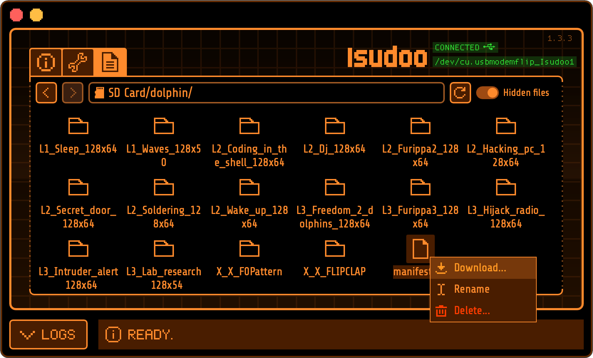
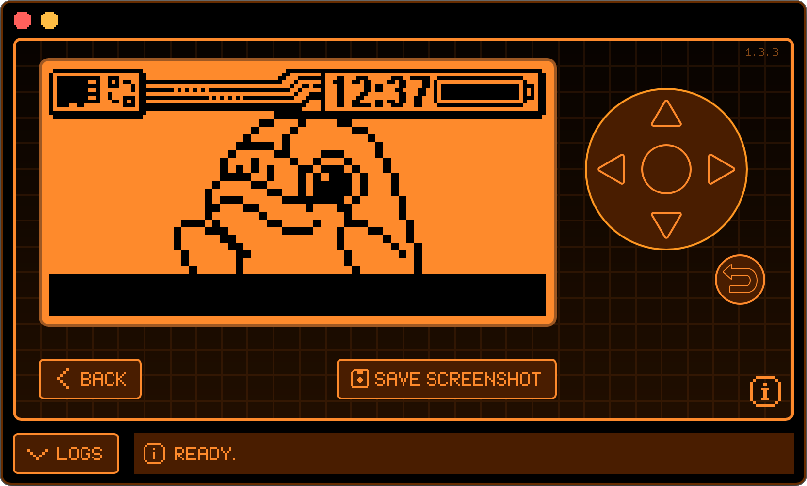

## Adding a Custom Animation to Your Flipper
<code style="color : green">test</code>

In this guide, we will go step by step through the process of setting up new Flipper Zero animations.

---

### 1. Getting the files
First, one needs to download animations to your local computer. Usually, they can be found on GitHub. 
For our example, we will take [Wr3nch's Flip0Anims repository](https://github.com/wrenchathome/flip0anims){:target="_blank"}

First simply click on the green "Code" button and select "Download Zip"



!!! note "Other creators' Flipper Zero Animation repos:"
    [Kuronons](https://github.com/Kuronons/FZ_graphics){:target="_blank"}<br>
    [Topbillin](https://github.com/topbillin/animations){:target="_blank"}<br>
    [LinusKay](https://github.com/LinusKay/flipperzero-animations){:target="_blank"}<br>
    [Evillero](https://github.com/evillero/flipper_animations){:target="_blank"}<br>
    

### 2. Prepare Your Animation Folder

In this example, we will prepare the `X_X_FLIPCLAP` and `X_X_FLIPPATTERN` animations:

 

After the download has finished, extract the `flip0anims-main.zip` file. You can find the `X_X_FLIPCLAP` and `X_X_FLIPPATTERN` folders in: `flip0anims-main > Animations > Flipper`.



!!! note "NOTE:"
    Make sure your animation folder contains:<br>

    - Your animation frames, numbered in order: `frame_0.bm`, `frame_1.bm`, and so on<br>
    - A ['"meta.txt"'](/tutorials/Animation_guide_meta/Meta_settings_guide/) file<br>

---

### 3. Copy the Folder(s) to Your SD Card

Copy the animation folders into the following directory on your Flipper's SD card via qFlipper:

```
/SD Card/dolphin/
```


---

### 4. Editing the `manifest.txt` file


In qFlipper, right click the `manifest.txt` file and select the Download option. Save it to your folder of choice.



The contents of your file should look like below:
```
Filetype: Flipper Animation Manifest
Version: 1

Name: L1_Waves_128x50
Min butthurt: 0
Max butthurt: 5
Min level: 1
Max level: 3
Weight: 3

Name: L1_Laptop_128x51
Min butthurt: 0
Max butthurt: 7
Min level: 1
Max level: 1
Weight: 3

Name: L1_Sleep_128x64
Min butthurt: 0
Max butthurt: 10
Min level: 1
Max level: 3
Weight: 3

...
```

!!! note "NOTE:"
    You can re-download the latest version of the `manifest.txt` file from the firmware repository:
    [https://github.com/flipperdevices/flipperzero-firmware/blob/dev/assets/dolphin/external/manifest.txt](https://github.com/flipperdevices/flipperzero-firmware/blob/dev/assets/dolphin/external/manifest.txt){:target="_blank"}

---

### 5. Add your Animation entry

Add the following block to your `manifest.txt`:

```
Name: REPLACEME
Min butthurt: 0
Max butthurt: 18
Min level: 1
Max level: 3
Weight: 3
```

> Replace `REPLACEME` with the exact name of your animation folder.

In this example, we add 2x of those code snippets to the start of our file, and then change the two `REPLACEME`'s to `X_X_FLIPCLAP` and `X_X_F0Pattern` so it looks like this:
```
Filetype: Flipper Animation Manifest
Version: 1

Name: X_X_FLIPCLAP
Min butthurt: 0
Max butthurt: 18
Min level: 1
Max level: 3
Weight: 3

Name: X_X_F0Pattern
Min butthurt: 0
Max butthurt: 18
Min level: 1
Max level: 3
Weight: 3

Name: L1_Waves_128x50
Min butthurt: 0
Max butthurt: 5
Min level: 1
Max level: 3
Weight: 3
```

!!! note "TIP:"
    To test only your new animations, remove the other entries. Make sure to back up the `manifest.txt` file first!
---

### 6. Apply changes and upload the file to Flipper

Save your changes to `manifest.txt`, and upload the file to your `/SD Card/dolphin/` folder

---

### 7. Reboot Your Flipper

Restart your Flipper. Your new animation should now appear!


!!! note "NOTE:"
    On each boot, a random animation will be chosen. You can not select manually which animation will play.<br>
    


---

**PS:** The `manifest.txt` on your SD card gets replaced with each firmware update. Make sure to back it up before you install the latest version.
